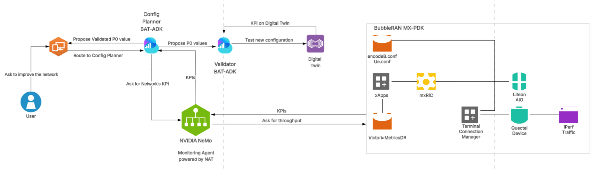
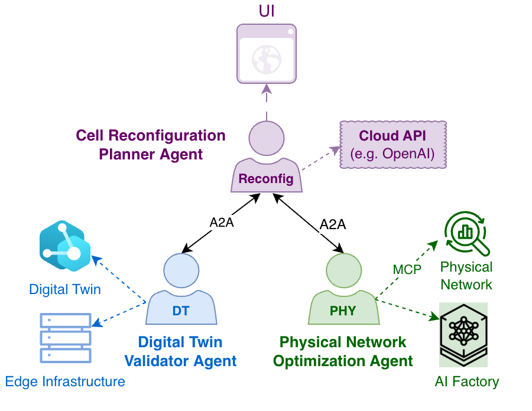

# Auto-RAN: AI Agents for Telecom Network Configuration Planning

## Overview

Modern telco RANs expose thousands of interdependent configuration parameters across:

- PHY and MAC controls
- RRC policy
- Power control
- Scheduling logic
- Network slicing parameters
- Interference coordination

These parameters directly impact:

- UL throughput
- DL throughput
- SNR
- MCS distribution
- HARQ outcomes
- Decoder indicators
- Latency
- Reliability
- Coverage
- Energy efficiency

They must be continuously tuned as traffic patterns, interference, mobility, and user behavior evolve, while preserving stability and minimizing operational risk.

The **AI Agent for Telecom Network Configuration Planning Blueprint** was originally introduced as a reference AI workflow showing how **Large Language Models** (LLMs), NVIDIA **NIM** microservices, and **O-RAN** integrations can assist telecom engineers with structured, KPI-driven 5G RAN configuration planning.

This Blueprint now provides two implementation options for the same monitor-plan-validate-enforce workflow:

- An original implementation that uses a **LangGraph-based framework** to orchestrate LLM agents.
- An enhanced implementation that integrates NVIDIA **NeMo Agent Toolkit** (NAT) with BubbleRAN's **BubbleRAN Agentic Toolkit** (BAT) to deliver a fully agentic, closed-loop control system, leveraging standard interoperability protocols such as **Agent-to-Agent** (A2A) communication and the **Model Context Protocol** (MCP).

## What This Blueprint Delivers

This enhanced blueprint defines an end-to-end, production-oriented AI workflow for autonomous RAN configuration, centered initially on P0-Nominal and designed to extend to additional RAN and broader telco parameters.

Core capabilities:

- **KPI monitoring** across live RAN traffic
- LLM-powered configuration planning over domain constraints
- Twin-first validation using a 5G **Digital Twin Network** (DTN)
- Safe enforcement through BubbleRAN O-RAN **rApp** workflows
- A2A and MCP compliance provided by the **BAT** and **NAT** toolkits
- NAT-based evaluation, profiling, and telemetry
- Modular deployment with containerized agents
- Extensibility to multi-parameter and multi-slice optimization

## The Role of NVIDIA NIM

A foundational component of both the original and updated blueprint is **NVIDIA NIM**.

NVIDIA NIM provides:

- Production-grade LLM inference
- Enterprise-ready model serving (hosted or on-prem)
- Scalable, low-latency inference endpoints
- Secure integration with NVIDIA AI Enterprise

In this blueprint, NIM serves the models behind:

- Monitoring agent reasoning
- Configuration planner logic
- Validation decision comparison
- Natural language intent interpretation
- Tool selection and orchestration

NIM enables:

- Reliable, low-latency inference suitable for operational environments
- Model flexibility (swap or upgrade LLMs via configuration)
- Telco-specific domain adaptation through NeMo fine-tuning
- Secure enterprise deployment

Without NIM, the LLM-driven reasoning layer of this blueprint cannot operate at production scale. It is the inference backbone of the agentic architecture.

## How NVIDIA Telco Config Blueprint, NIM, NAT, BAT and rApp SDK Work Together

NVIDIA Telco Config Blueprint package:

- NIM microservices
- Reference code
- Helm charts
- Documentation
- Deployment artifacts

In Auto-RAN:

- **NIM** provides LLM inference for monitoring, configuration planning, validation reasoning, and natural-language interaction.
- **NAT** provides the agent runtime, orchestration, tool abstraction (autowrapper), evaluation, and profiling capabilities.
- BubbleRAN's **rApp SDK** provides the logic and tools for interacting with RAN KPIs, configuration parameters, and O-RAN workflows.
- Both **NAT** and **BAT** provide A2A and MCP protocols compliance.
- **BubbleRAN MX-PDK and MX-DT** expose physical 5G O-RAN and Digital Twin Network environments where configuration changes can be validated before live enforcement. These capabilities are exposed to the Auto-RAN agents as MCP servers hosted on a **public BubbleRAN server**.

Together, they form a production-oriented, agentic RAN optimization system.

## Agentic Architecture

[https://lucid.app/lucidchart/75b91e31-56ef-4f4e-99b9-90babde88bb2/edit?invitationId=inv_86d91e01-12f5-4af3-b41a-02cfee3ca5e3&page=vap1QSe4yAUW3#](https://lucid.app/lucidchart/75b91e31-56ef-4f4e-99b9-90babde88bb2/edit?invitationId=inv_86d91e01-12f5-4af3-b41a-02cfee3ca5e3&page=vap1QSe4yAUW3)

The blueprint's architecture implements a closed-loop monitor-plan-validate-enforce workflow using three specialized agents that share network context and KPI telemetry.

In the enhanced implementation, these agents run on

- NVIDIA **NeMo Agent Toolkit** (NAT): _Monitoring Agent_
- BubbleRAN's **BubbleRAN Agentic Toolkit** (BAT): _Validator Agent, Config Planner Agent_

and interact with BubbleRAN's MX-PDK live RAN, MX-DT Digital Twin Network using MCP tools exposed on a public BubbleRAN server to realize a fully agentic control loop.

### 1\. Monitoring Agent

(BubbleRAN BAT-ADK + NVIDIA NAT + NIM)

- Observes real-time KPIs and configuration (P0 Nominal)
- Aggregates metrics over defined windows
- Uses NAT autowrapper for tool standardization

### 2\. Configuration Planner Agent

(BubbleRAN BAT-ADK + NIM)

- Interprets natural language intent
- Requests live KPI and configuration context to Monitoring Agent
- Forecasts configuration impact
- Proposes candidate parameter values
- Coordinates validation with Validation Agent
- Recommends or enforces changes

This Agent supports two types of intents:

- **Monitoring-only**: monitor KPIs or configuration. The intent is forwarded to the Monitoring Agent and the response is returned directly to the user.
- **Optimization**: based on the current KPIs and configuration (Monitoring Agent), predict a new configuration, validate it in a DTN (Validation Agent) and enforce it if it leads to better performance.

### 3\. Validation Agent

(BubbleRAN BAT-ADK + NIM + BubbleRAN MX-DT)

- Instantiates a Digital Twin Network on demand
- Applies candidate configurations
- Run traffic simulation
- Compares baseline vs candidate KPIs
- Returns the validation result (success or failure) with a brief explanation

Only validated configurations are promoted to the physical RAN by the Config Planner.

## New Improvements Introduced by NAT

The enhanced implementation adds NVIDIA NeMo Agent Toolkit (NAT) to transform the Telco Network Configuration Planner from a scripted automation into an industrial grade, measurable agentic system.

### 1\. Autowrapper Interoperability

NAT's automatic wrapper enabled:

- Encapsulation of existing BubbleRAN ADK monitoring logic
- Minimal refactoring
- Immediate interoperability
- Shared A2A communication compatibility

### 2\. Evaluation-Driven Engineering

NAT introduces measurable evaluation with:

- ResponseGroundness
- AnswerAccuracy
- ContextRelevance (RAGAS derived)
- Trajectory (NAT native)
- Token usage (cost proxy)

This converts agent behavior into quantifiable metrics.

### 3\. Profiler and Cost Visibility

NAT profiler enables:

- Latency measurement
- Token consumption tracking
- Model comparison
- Prompt regime experimentation

This supports cost-quality tradeoff optimization.

### 4\. Prompt Regime Optimization

Testing included:

- Model: qwen3:0.6b baseline
- 10 representative requests
- 2 negative/out-of-scope prompts
- Three system prompt regimes:
  - Minimal
  - Guided
  - Forced tool

Key findings:

- Larger models did not consistently improve tool invocation reliability.
- Some 7B models struggled with consistent tool calling.
- Guided prompts delivered the best balance between quality and token cost.

This demonstrates that evaluation - not model size alone- determines performance.

### 5\. Governance and Industrialization

NAT adds:

- Exportable telemetry
- Evaluation pipelines
- Reliability scoring
- Correctness measurement
- Stability monitoring

This transforms the blueprint from experimental automation into an industrializable system.

## Digital-Twin-First Safety Layer

The enhanced implementation mandates that every configuration change be validated in a 5G **Digital Twin Network** (BubbleRAN **MX‑DT**) before it can be applied to the live network. This creates a safety layer that reduces the risk of regressions while still allowing autonomous optimization of sensitive RAN parameters such as P0‑Nominal.

The validation process:

- Clone the current baseline configuration into MX‑DT.
- Apply the candidate parameter changes proposed by the planner.
- Execute a defined simulation in a validation window and capture KPIs.
- Compare baseline and candidate KPIs using agreed‑upon metrics. Return an outcome that gates promotion to the live network.

This reduces regression risk while enabling autonomous optimization.

## Platform Stack

Integrated NVIDIA-BubbleRAN stack:

- BubbleRAN [MX-PDK](https://bubbleran.com/products/mx-pdk/) (physical O-RAN / AI-RAN network)
- BubbleRAN [MX-DT](https://bubbleran.com/products/mx-dt/) (digital twin)
- BubbleRAN [MX-AI](https://bubbleran.com/products/mx-ai/) (AI service integration)
- BubbleRAN BAT-ADK
- NVIDIA NIM (LLM inference backbone)
- NVIDIA NAT (agentic runtime + evaluation)
- NVIDIA AI Enterprise + NeMo (domain fine-tuning)

## Requirements

### Agentic Workflow Requirements

- Python 3.12+ (3.13 recommended)
- Modern Linux OS (Ubuntu 22.04 recommended)
- NVIDIA API key from NVIDIA Build
- Docker (tested on version 29.2.1)
- Docker composed (tested on version v5.1.0)

### BubbleRAN-Side Requirements

- Public testbed exposing MCP Servers for the Agents tools which need interaction with a live network (MX-PDK)
- MX-DT digital twin setup

## Deployment Overview

- Create NVIDIA API key in NVIDIA Build
- Clone the repository [https://github.com/bubbleran/auto-ran](https://github.com/bubbleran/auto-ran/)
- Run the notebook at the root of the repository

### Disclaimer

This is a reduced version of the **Auto-RAN Blueprint** that was demonstrated during **Mobile World Congress 2026**.

The complete blueprint cannot be publicly distributed because the full implementation relies on proprietary software and hardware components from multiple vendors, including **BubbleRAN**.

The version provided in this repository uses a simplified 5G network environment based on **OpenAirInterface** RF simulation (rfsim). This setup allows the agentic workflow and orchestration logic to be demonstrated but does not reproduce the full behavior of a physical RAN deployment. In particular, the RF simulation environment does not fully support P0-Nominal power control adjustments, meaning that configuration changes may not produce observable KPI variations in the simulated network.

A demonstration of the full blueprint execution can be viewed in the following video.

Organizations interested in the complete system, technical details, or a live demonstration using real hardware are encouraged to [contact BubbleRAN](https://bubbleran.com/contact/) to arrange further discussions or a dedicated session.

## Target Users

- RAN operators seeking autonomous optimization
- Network engineers reducing manual tuning
- Telecom operators improving energy efficiency
- AI platform teams demonstrating NeMo Agentic Toolkit
- Researchers exploring multi-slice optimization

## License and Disclaimer

Blueprint artifacts are provided for experimentation and evaluation.

Production deployments must implement:

- Trust boundaries
- Logging and monitoring
- Secure communication
- Authentication and authorization
- Patch management
- Vulnerability management

Operational security remains the responsibility of the deploying organization.
